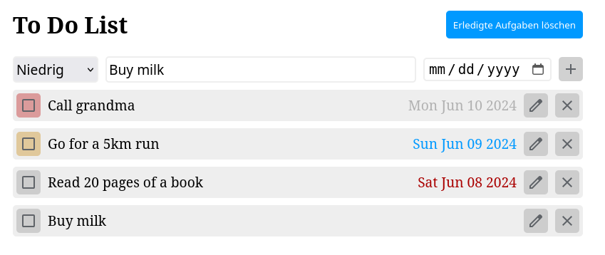

# Simple To-Do List

This project is a simple to-do list application built with HTML, CSS, and JavaScript. It allows users to add, complete, and delete tasks from their list.

## Demo

You can try out the live demo of the to-do list application [here](https://eugengul.github.io/todolist/).

## Screenshot

